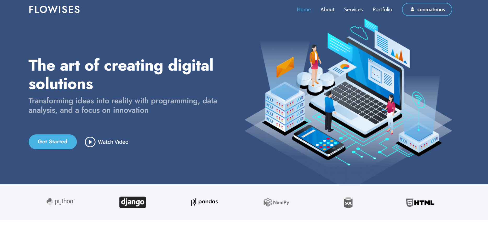
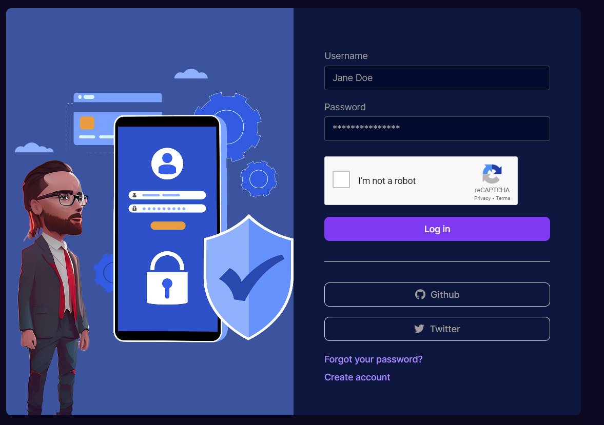

# DjangoTUBE
View live page: [view live](https://flowises.com/)

This is a Django web application that allows you to search YouTube and extract public data such as views, title, description, upload date, channel name, channel views, thumbnail, and more data using the youtubesearchpython library. It also includes a title improvement functionality using GPT-3, as well as a data section where users can see all the searches they have made, download all the data in a CSV file, and delete all their searches and data if they wish. But this is just the beginning. What makes this project truly impressive is its ability to analyze data and present it in a visual and meaningful way to the user.

I have integrated several charts and tables so that users can quickly see the results of their searches, and I have also added a title improvement functionality, which uses OpenAI's GPT-3 API to generate improved and inspired titles based on the most relevant titles found in the search.

Main page

Login

## Architecture

The Django application follows a Model-View-Controller (MVC) architecture. The model defines the structure of the database and how data is stored. The view defines how information is displayed to the user. The controller handles user requests and sends the information to the corresponding model and view.

## Database

The application uses an SQLite3 database, which is included in the Django package. Search data and user data are stored in the database. This database is for development, and in production, you can switch to databases like PostgreSQL, MySQL, MariaDB, among others.

## Installation

1. Clone the repository: `git clone https://github.com/Gustavoandresai/DjangoTUBE.git`
2. Create a virtual environment: `python -m venv venv`
3. Activate the virtual environment: `source venv/bin/activate` (on Unix/Linux) or `venv\Scripts\activate` (on Windows)
4. Move the youtubesearchpython folder: `mv youtubesearchpython /venv/lib/site-packages/`
5. Install the required packages: `pip install -r requirements.txt`
6. Run the migrations: `python manage.py migrate`
7. Create a superuser: `python manage.py createsuperuser`
8. Start the server: `python manage.py runserver`

## Tools Used

Some important tools used in the application include:

- Django: a Python web framework developed by Django Software Foundation.
- The youtubesearchpython library: a Python library for searching YouTube developed by Alex Mitchell.
- OpenAI API: an artificial intelligence platform for generating text developed by OpenAI.
- Pandas: a Python library for data analysis and manipulation developed by Wes McKinney and other contributors.

## Steps to Test the Application

To test the application, follow these steps:

1. Register on the homepage.
2. Search YouTube using the search bar on the homepage.
3. Customize the amount of results shown in the results table and use the charts that display relevant information.
4. Use the title improvement functionality or the generation of inspired titles with GPT-3 to create an original and improved title.
5. Go to the data section to see all the searches you have made and download all the data in a CSV file.
6. If you want to delete all your searches and data, you can do so in the data section.

## Features:

- Registration and login: Users can register and then log in to access all functions with the option to change their password.
- CRUD: There is a CRUD functionality that allows users to create, read, update, and delete elements from the database.
- YouTube search: Users can search on YouTube and extract public data using the youtubesearchpython library.
- Results table: Users can see the results of their searches in a table and customize the amount of results shown.
- Charts: There are charts that display relevant information using the pandas and plotly-express libraries.
- Title improvement: Users can improve their own titles and specific titles created based on and inspired by their searches.
- Data section: Users can see all the searches they have made and download all the data in a CSV file.
- Data deletion: Users can delete all their searches and data if they wish.
- Responsive design: It is designed to be responsive, meaning it adapts to different screen sizes, such as mobile devices and tablets.
- User interface: The project has an intuitive and easy-to-use user interface, with clearly defined buttons and forms for each function.
- Credits: is a tool designed to limit abusive. Each time users utilize the tool, a pre-established amount of credits will be deducted. Credits are automatically recharged as users spend them. 

## License

This project is licensed under the MIT License. You can see more details in the LICENSE file.

## Contact

If you have any questions or comments about this project, feel free to contact me through my email or my GitHub profile.
